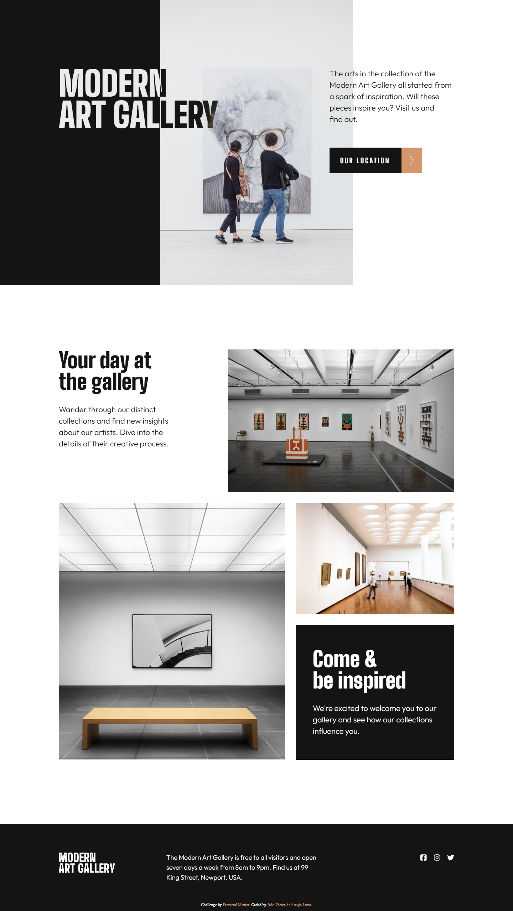
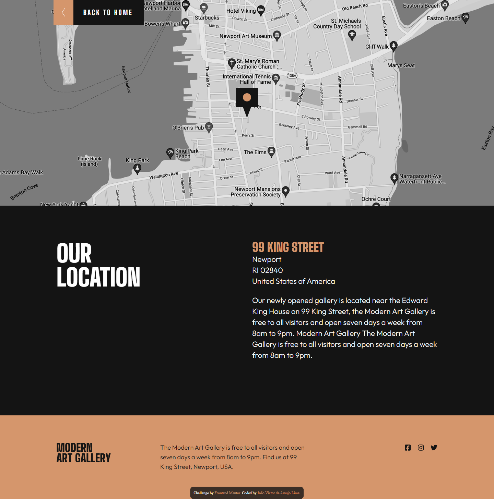
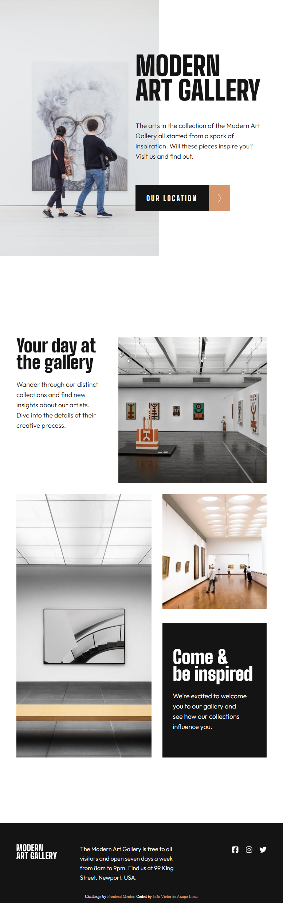
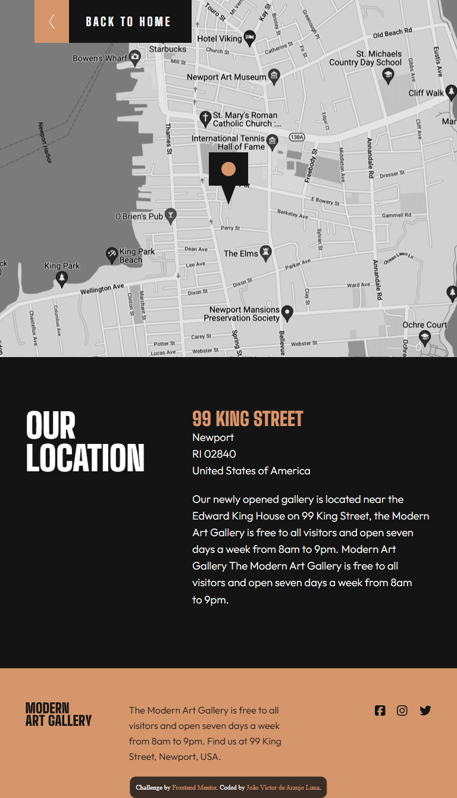
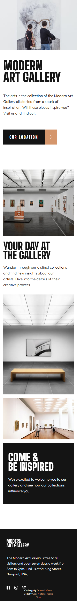
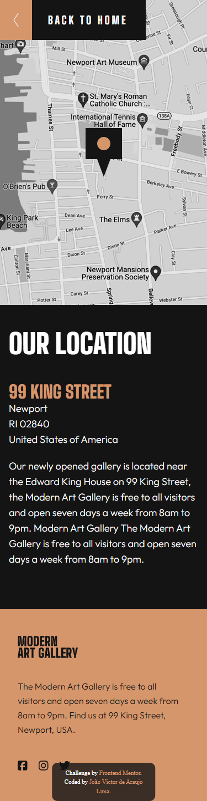

# Frontend Mentor - Art gallery website solution

## Languages
This first section is in English. 

[Versão em português logo abaixo.](#portuguese)

## Context

This is a solution to the [Art gallery website challenge on Frontend Mentor](https://www.frontendmentor.io/challenges/art-gallery-website-yVdrZlxyA). Frontend Mentor challenges help you improve your coding skills by building realistic projects. 

> Your challenge is to build out this art gallery website and get it looking as close to the design as possible.

## Table of contents

- [Overview](#overview)
  - [The challenge](#the-challenge)
  - [Screenshot](#screenshot)
  - [Links](#links)
- [My process](#my-process)
  - [Built with](#built-with)
  - [What I learned](#what-i-learned)
- [Author](#author)

## Overview

### The challenge

Users should be able to:

- View the optimal layout for each page depending on their device's screen size
- See hover states for all interactive elements throughout the site
- <s> **Bonus**: Use [Leaflet JS](https://leafletjs.com/) to create an interactive location map with custom location pin </s>

### Screenshot

#### Desktop

<p align="center">
  
</p>

<p align="center">
  
</p>

#### Tablet

<p align="center">
  
</p>

<p align="center">
  
</p>

#### Mobile

<p align="center">
  
</p>

<p align="center">
  
</p>

### Links

- Solution URL: [GitHub Repository](https://github.com/xuaun/art-gallery-website) and [my Frontend Mentor solution page](https://www.frontendmentor.io/solutions/responsive-art-gallery-website-zr6MhaWocZ)
- Live Site URL: [Live Page](https://xuaun.github.io/art-gallery-website/)

## My process

### Built with

- Semantic HTML5 markup
- CSS custom properties
- Flexbox
- CSS Grid
- Media Query + clamp()

### What I learned

In this project I was able to use flexbox, grid, variable, and media query concepts in CSS, as well as using a ready-made Figma design to create this component. I also used `rem` for measurements, `clamp()` to help with responsiveness, and BEM methodology for naming classes.

I really enjoyed doing this project and learned a lot by styling objects on top of other objects on the screen and how to work with them responsively.

```css
.hero__pic {
  position: absolute;
  top: calc(-1 * clamp(14.5rem, 9.609rem + 6.522vw, 19rem));
  left: calc(
    clamp(0rem, -75rem + 83.333vw, 45rem) -
      clamp(4rem, -9.587rem + 18.116vw, 16.5rem)
  );
  z-index: -1;
}
```

## Author

- Website - [João Víctor de Araujo Lima's Portfolio](https://xuaun.github.io/)
- Frontend Mentor - [@xuaun](https://www.frontendmentor.io/profile/xuaun)

____
<br>

# <p id="portuguese">Frontend Mentor - Solução do projeto de Site de galeria de arte</p>

## Contexto

Esta é uma solução para o [desafio de site de galeria de arte no Frontend Mentor](https://www.frontendmentor.io/challenges/art-gallery-website-yVdrZlxyA). Os desafios do Frontend Mentor ajudam você a melhorar suas habilidades de codificação construindo projetos realistas.

> Seu desafio é criar o site desta galeria de arte e deixá-lo o mais próximo possível do design.

## Lista de conteúdos

- [Visão Geral](#visão-geral)
  - [Desafio](#desafio)
  - [Prints](#prints)
  - [Links](#links-pt)
- [Meu processo](#meu-processo)
  - [Tecnologias utilizadas](#tecnologias-utilizadas)
  - [O que eu aprendi](#o-que-eu-aprendi)
- [Autor](#autor)

## Visão Geral

### Desafio

Os usuários devem ser capazes de:

- Visualizar o layout ideal dependendo do tamanho da tela do dispositivo
- Veja os estados de foco para elementos interativos
- <s> **Bônus**: Use [Leaflet JS](https://leafletjs.com/) para criar um mapa de localização interativo com um pino de localização personalizado </s>

### Prints

#### Computador

<p align="center">
  
</p>

<p align="center">
  
</p>

#### Tablet

<p align="center">
  
</p>

<p align="center">
  
</p>

#### Celular

<p align="center">
  
</p>

<p align="center">
  
</p>

### <p id="links-pt">Links</p>

- Link da solução: [Repositório no GitHub](https://github.com/xuaun/art-gallery-website) e a [página da minha solução no Frontend Mentor](https://www.frontendmentor.io/solutions/responsive-art-gallery-website-zr6MhaWocZ)
- Site com a solução: [Página do projeto no ar](https://xuaun.github.io/art-gallery-website/)

## Meu processo

### Tecnologias utilizadas

- HTML5
- CSS
- Flexbox
- CSS Grid
- Media Query + calmp()

### O que eu aprendi

Neste projeto eu pude utilizar conceitos de flexbox e grid, de variáveis e de media query no CSS, além de usar um design pronto do Figma para a elaboração deste componente. Eu também usei `rem` para medidas, `clamp()` para ajudar na responsividade e metodologia BEM para nomear classes.

Eu gostei bastante de fazer este projeto e aprendi bastante fazendo os estilos para objetos sobre outros objetos na tela e como trabalhar com eles responsivamente.

```css
.hero__pic {
  position: absolute;
  top: calc(-1 * clamp(14.5rem, 9.609rem + 6.522vw, 19rem));
  left: calc(
    clamp(0rem, -75rem + 83.333vw, 45rem) -
      clamp(4rem, -9.587rem + 18.116vw, 16.5rem)
  );
  z-index: -1;
}
```

## Autor

- Website - [Portfólio - João Víctor de Araujo Lima](https://xuaun.github.io/)
- Frontend Mentor - [@xuaun](https://www.frontendmentor.io/profile/xuaun)
